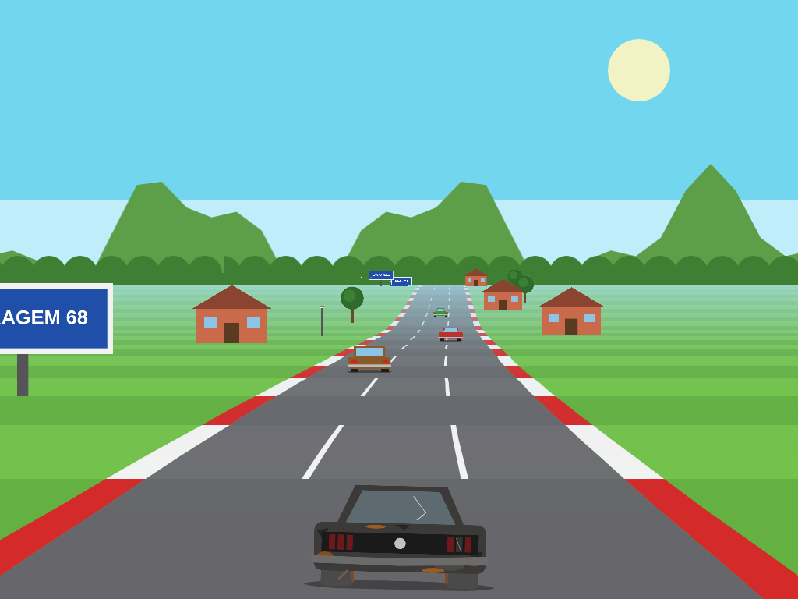

# 1. Decisões de design fechadas

Todas as decisões abaixo são **finais**. O implementador não escolhe alternativas.

## 1.0 Respostas da família que fixaram o escopo

| Pergunta | Resposta | Consequência |
|---|---|---|
| Um iPad para os dois ou um cada? | Um por vez (mesmo iPad) | 2 perfis no mesmo aparelho, escolhidos na tela inicial; sem tela dividida |
| Vista da corrida | **Traseira pseudo-3D** (estilo Out Run) | Pista em segmentos com curva/morro, câmera atrás do carro, sprites escalados |
| Arte final | Não nesta versão | Tudo com placeholders do manifesto; o pipeline de troca continua pronto (Fase 2 fica para depois) |
| App Store | Talvez no futuro | PWA agora; save atrás de `StorageBackend` para migrar ao Capacitor depois (seção 13) |
| Dislexia/daltonismo | Não | Nenhuma adaptação específica |

## 1.1 Stack

| Item | Decisão |
|---|---|
| Linguagem | JavaScript ES2022, **módulos ES nativos** (`<script type="module">`), sem TypeScript, sem bundler, sem npm em runtime |
| Render | **Canvas 2D** (um `<canvas>` de tela cheia) para pista/carros; **DOM + CSS** para menus, HUD e botões de toque |
| Engine | Nenhuma (sem Phaser). Justificativa: (1) o render pseudo-3D é um algoritmo próprio (projeção de segmentos) que nenhuma engine 2D oferece pronto; (2) Phaser traz ~1 MB e APIs de versões diferentes que confundem modelos simples; (3) módulos pequenos e puros são testáveis em Node sem DOM; (4) zero build = o arquivo editado é o arquivo servido. |
| Tipos | JSDoc (`@typedef`, `@param`, `@returns`) em todo arquivo público |
| Testes | `node --test tests/` (Node ≥ 20, só para desenvolvimento; nenhum pacote externo) |
| Servidor de dev | `python3 -m http.server 8080` na raiz do projeto |
| Áudio | Web Audio API; **todo som é um `AudioBuffer`** (placeholder = sintetizado em `OfflineAudioContext`; final = arquivo decodificado) |
| Save | `localStorage`, atrás da interface `StorageBackend` (trocável por Capacitor Preferences) |
| Offline | Service worker com precache versionado gerado por `tools/build-precache.mjs` |

## 1.2 Câmera: traseira pseudo-3D



*Quadro gerado pelo protótipo de referência ([referencia/prototipo-render.html](referencia/prototipo-render.html)) com os dados reais: pista t1, Mustang ferrado, 3 adversários, decoração do tema "bairro".*

| Parâmetro | Valor |
|---|---|
| Técnica | Pseudo-3D por segmentos (estilo Out Run): a pista é uma lista de segmentos de 200 u; cada um tem curvatura e altura; é projetada em perspectiva e desenhada como trapézios |
| Câmera | Atrás e acima do jogador (altura 1000 u, campo de visão 100°), acompanha o x do jogador exatamente |
| Carro do jogador | Sempre no **centro inferior** da tela, ~23% da largura; inclina ±0,06 rad ao virar; treme 2 px fora da pista |
| Distância de desenho | 150 segmentos (30.000 u), com neblina na cor do tema |
| Fundo | 3 camadas com paralaxe horizontal nas curvas (céu, morros, árvores/prédios) |
| Minimapa | Canto superior direito, 200×140 px lógicos, traçado aproximado (integração das curvas) com pontos dos carros |
| Garagem | Vista **lateral** do Mustang (perfil hardtop), onde rodas, cromados e faixas aparecem |

Justificativa: é a vista que a família escolheu; ◀/▶ sempre significam esquerda/direita da tela; a traseira do Mustang 68 (lanternas de 3 barras) é reconhecível e mostra a restauração durante a corrida.

## 1.3 Resolução lógica e escala

| Item | Valor |
|---|---|
| Altura lógica | **768** px lógicos fixos |
| Largura lógica | `round(768 × larguraCSS / alturaCSS)` (iPad 4:3 → 1024; iPad Air 1180×820 → 1105) |
| px lógico → px CSS | `uiScale = alturaCSS / 768`; a UI DOM usa `font-size: calc(16px * uiScale)` na raiz e medidas em `rem` (1 rem = 16 px lógicos) |
| Backing store do canvas | `larguraCSS × min(devicePixelRatio, 2)`; o render pseudo-3D desenha em px lógicos com `ctx.setTransform(escala,0,0,escala,0,0)` |
| Unidades de mundo | z (ao longo da pista) em u; segmento = 200 u. Lateral `x` **normalizado**: 0 = centro, ±1 = borda do asfalto, carro tem largura 0,5 |
| km/h exibido | `velocidade × 0,0165` (7.700 u/s → 127 km/h; 13.650 u/s → 225 km/h) |

## 1.4 Esquema de controle

```
┌──────────────────────────────────────────────────────────────┐
│ [⏸]  3º/6   Volta 2/3                         [minimapa]     │
│                                                              │
│                    (pista em perspectiva)                    │
│                                                              │
│                                                  [ACELERAR]* │
│  [ ◀ ]  [ ▶ ]          (Mustang)    127 km/h      [ FREIO ]  │
└──────────────────────────────────────────────────────────────┘
* ACELERAR só aparece se "Acelerar sozinho" estiver DESLIGADO.
```

| Controle | Tamanho lógico | Posição (a partir da safe area) | Comportamento |
|---|---|---|---|
| ◀ | 150×150 | esquerda 24, base 24 | enquanto pressionado: `steer = -1` |
| ▶ | 150×150 | esquerda 198, base 24 | enquanto pressionado: `steer = +1` (◀+▶ juntos = 0) |
| FREIO | 150×150 | direita 24, base 24 | `brake = 1`; com velocidade > 50% da máxima e \|steer\| > 0,5 vira **derrapagem** (segura melhor a curva, perde velocidade) |
| ACELERAR | 150×190 | direita 24, base 198 | `throttle = 1` (apenas se aceleração automática desligada) |
| ⏸ | 72×72 | esquerda 16, topo 16 | abre Pausa |

- Entrada via **Pointer Events** em cada botão (multitoque nativo: cada botão rastreia seu próprio `pointerId`). `pointerup`/`pointercancel`/`pointerleave` soltam o botão.
- Aceleração automática **ligada por padrão** (`throttle = 1`, exceto com FREIO → 0).
- Assistência de direção 3 níveis (Desligada 0 / Média 0,35 / **Forte 0,7 = padrão**). Ela compensa parte da força da curva e segura o carro na borda; quando é ela que está virando, o carro alivia para 85% da velocidade. Resultado simulado: **sem tocar na tela, o carro completa qualquer pista sem sair do asfalto, 12–16% mais lento que a IA**. Quem vira nas curvas ganha tempo. Fórmula em [07 §7.5](07-fisica-ia.md).
- Nada de acelerômetro (exige permissão no iOS e cansa o braço).

Justificativa: o polegar esquerdo só vira, o direito só freia. Botões grandes (≥ 150 px lógicos ≈ 2,9 cm no iPad 10,2") toleram imprecisão de crianças.

## 1.5 Formato das pistas

| Item | Decisão |
|---|---|
| Representação | Lista de **seções** `{n:[entrada, meio, saída], curve, hill}`; cada seção vira `entrada+meio+saída` segmentos de 200 u |
| Curva | `curve` de −6 a +6 (positivo = direita); sobe com *ease-in* na entrada, constante no meio, cai com *ease-out* na saída |
| Morro | `hill` = variação de altura da seção em múltiplos de 200 u (+ sobe); interpolação *ease-in-out*; soma dos `hill` da pista = 0 |
| Circuito | Fechado: o último segmento liga no primeiro; comprimento da volta = nº de segmentos × 200 |
| Largura | Asfalto fixo: meia-largura 1000 u, 3 faixas; zebra = 1/6 da meia-largura além da borda; depois grama até o infinito |
| Limite lateral | `|x| ≤ 2,0` (o carro nunca se perde; não existe muro) |
| Beira de pista | Objetos (árvores, casas, postes…) a `|x|` entre 1,8 e 4,0, por semente fixa; placas de curva automáticas antes de toda curva com `|curve| ≥ 3`; pórtico de largada no segmento 0 |
| Voltas | 3 por corrida; sem checkpoints (só se anda para frente) |
| Validação | 8 pistas em `dados/tracks.json`, simuladas: corrida de 81–85 s para a IA no nível de desbloqueio; nenhuma saída de pista da IA |

| Pista | Segmentos | Curva máx. | Morro máx. | Tema |
|---|---|---|---|---|
| t1 Rua do Bairro | 1.025 | 3 | 10 | bairro |
| t2 Vila das Palmeiras | 1.035 | 3 | 12 | bairro |
| t3 Avenida do Porto | 1.150 | 4 | 20 | cidade |
| t4 Parque da Cidade | 1.220 | 4 | 20 | cidade |
| t5 Serra das Curvas | 1.280 | 5 | 30 | serra |
| t6 Estrada do Litoral | 1.410 | 5 | 25 | serra |
| t7 Autódromo Clássico | 1.440 | 6 | 20 | autódromo |
| t8 Grande Final | 1.610 | 6 | 30 | autódromo |

## 1.6 Corrida

| Item | Valor |
|---|---|
| Carros | 6 (jogador + 5 IA) |
| Grid | 3 filas de 2, atrás da linha (fila 1 a 400 u, filas a cada 600 u), colunas em x = −0,45 / +0,45; jogador no slot 4 (2ª fila, direita); IAs em ordem decrescente de rating nos outros slots |
| Contagem | 3-2-1-VAI! (3 s) |
| Fim | Quando o **jogador** completa a 3ª volta: classificação = ordem atual de progresso (IAs que já terminaram mantêm a ordem de chegada). Depois disso a IA dirige o Mustang por 2 s até a tela de resultado. |
| Sem game over | Qualquer posição paga prêmio |
| Sem reboque | Não há como ficar preso: sempre se anda para frente e `|x|` é limitado a 2,0 |
| Batidas | Sem dano. Batida em carro ou objeto de beira de pista reduz a velocidade (carro: segue o da frente a 95%; objeto: perde 50%) e conta para o bônus "corrida limpa" (≤ 2 batidas) |
| Pausa | Botão ⏸ e automática em `visibilitychange`/`pagehide`/`blur` |

## 1.7 Perfis, dificuldade e textos

| Item | Decisão |
|---|---|
| Perfis | Exatamente 2 slots fixos (`p1`, `p2`) no mesmo iPad, nome editável (máx. 12 caracteres) e capacete de cor (4 opções) |
| Dificuldade | Por perfil: Tranquilo (padrão), Normal, Desafio; trocável na tela de seleção de pista |
| Idioma | pt-BR, todos os textos em `src/ui/strings.js`; frases ≤ 6 palavras em botões |
| Moeda | Símbolo `$`, formato `$ 1.250` (ponto como milhar), sem centavos |
| Nível do carro | Média arredondada dos 5 atributos (0–100). Desbloqueia pistas. |

## 1.8 Fora de escopo (não implementar)

Multiplayer/tela dividida, rede, contas, analytics, anúncios, compras reais, conquistas/loot box, timers de energia, recompensas diárias, notificações, marcha à ré, dano mecânico, clima, noite, arte final (Fase 2), bifurcações de pista estilo Out Run, tráfego civil.
