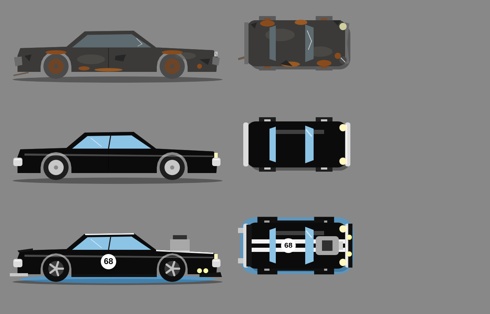

# 5. Sistema de camadas visuais do carro



*Render real das receitas `ph` de `dados/assets.manifest.json` (linha 1: ferrado; 2: restaurado; 3: máximo com estética).*

## 5.1 Camadas, ordem de desenho e quem controla

`z` menor desenha primeiro (fica embaixo). Mesma ordem nas duas vistas.

| z | Camada | Padrão (ferrado) | Variantes | Controlada por |
|---|---|---|---|---|
| 0 | `sombra` | `base` | base | fixa |
| 5 | `neon` | — | azul | `c_luz_neon` |
| 10 | `pneus` | `careca` | careca, novo, esportivo, slick | `pne_1..3` |
| 20 | `rodas` | `enferrujada` | enferrujada, original, cinco_raios, cromada, raiada, preta | `rod_1` (prio 10), `c_rod_*` (prio 100) |
| 30 | `carroceria` | `base` | base (metal cinza; silhueta) | fixa |
| 40 | `pintura` | `desbotada` | desbotada, preta, preta_brilhante, vermelha, azul, verde, branca | `pin_1` (10), `pin_2` (20), `c_cor_*` (100) |
| 50 | `ferrugem` | `ferrugem` | ferrugem | `fer_1` → oculta |
| 60 | `amassados` | `amassado` | amassado | `fun_1` → oculta |
| 70 | `faixas` | — | dupla_branca, dupla_vermelha, lateral, dupla_dourada | `c_fai_*` |
| 80 | `adesivos` | — | numero_68, raio, chamas | `c_ade_*` |
| 90 | `vidros` | `trincado` | trincado, limpo | `vid_1` |
| 100 | `capo` | — | tomada_ar, compressor | `mot_3`/`mot_4` (10), `ind_1` (20), `ind_2` (30) |
| 110 | `escapamento` | `furado` | furado, simples, duplo, esportivo | `esc_1..3` |
| 120 | `parachoques` | `amassado` | amassado, cromado | `pch_1` |
| 130 | `farois` | `trincado` | trincado, novo | `far_1` |
| 140 | `aero` | — | defletor, kit | `aer_1..2` |
| 150 | `aerofolio` | — | rabo_de_pato, asa_alta | `c_aer_*` |
| 160 | `luzes` | — | auxiliares | `c_luz_aux` |

Efeitos que **não** são camadas (desenhados por `effects.js`): fumaça do escapamento (`flags.fumaca`), marcas de pneu, faíscas.

## 5.2 Algoritmo de resolução (`render/carLayers.js` → `resolveCarLayers`)

```
entrada: profile, data, catalog, view ('top'|'side')
1. variant[layer.id] = layer.default; prio[layer.id] = 0          para cada layer de car.json
2. fontes = []
   para cada slot de restauração/desempenho:
       para t = 1 .. tier(installed[slot]):  fontes.push(peça do slot com tier t)
   para cada slot estético com equipped[slot] != null: fontes.push(peça equipada)
   (ordem de fontes = ordem de parts.json; isso decide empates)
3. para cada peça em fontes, para cada v em peça.visual:
       se v.priority >= prio[v.layer]: variant[v.layer] = v.variant; prio[v.layer] = v.priority
4. saída = layers de car.json, ordenadas por z, filtrando variant == null,
   mapeadas para { layerId, variant, z, assetId: `car.${view}.${layerId}.${variant}` }
5. se assets.has(assetId) == false → lançar Error (dados inconsistentes; o teste de dados pega antes)
```

Propriedades garantidas (testar em `carLayers.test.js`):
- Perfil novo → 11 camadas: sombra, pneus.careca, rodas.enferrujada, carroceria.base, pintura.desbotada, ferrugem, amassados, vidros.trincado, escapamento.furado, parachoques.amassado, farois.trincado.
- `fer_1` instalado → `ferrugem` some.
- `pin_2` instalado → pintura = `preta_brilhante` (tier 2 vence tier 1 por prioridade 20 > 10).
- `c_cor_vermelha` equipada → pintura = `vermelha` (prio 100); desequipar → volta a `preta_brilhante`.
- `mot_4` + `ind_2` → capo = `compressor`.

## 5.3 Composição e cache (`render/carCompositor.js`)

- Chave de cache = `view + ':' + layersKey(layers)`; `layersKey` = `"layerId=variant"` unidos por `|` na ordem de z.
- Canvas offscreen do tamanho `size × artScale × dpr` (top: 224×112×dpr; side: 1280×480×dpr).
- Para cada camada: `ctx.drawImage(assets.getImage(assetId), 0, 0, W, H)` (todas as camadas da mesma vista têm **o mesmo tamanho e a mesma âncora**, então não há offset).
- LRU com 8 entradas. Oponentes não passam pelo compositor (1 sprite cada).
- Na corrida, o sprite do jogador é composto **uma vez** no `enter` do estado.

## 5.4 Convenções para a arte final (contrato com o artista)

| Item | Vista de cima (`top`) | Vista lateral (`side`) |
|---|---|---|
| Tamanho lógico / PNG | 112×56 / **224×112** | 640×240 / **1280×480** |
| Frente do carro | aponta para a **direita** (+x) | aponta para a **direita** |
| Âncora | centro (0,5; 0,5) = centro do carro | (0,5; 0,9) = chão sob o meio do carro |
| Área do carro | x 8–104, y 6–50 (lógico) | para-choque traseiro x≈28, dianteiro x≈620; chão y=216 |
| Centro das rodas | — | traseira (150,180), dianteira (482,180); raio pneu 36–38, aro 22 |
| Fundo | transparente | transparente |
| Iluminação | luz vinda do topo-esquerdo da tela | idem |
| Pontos de efeito | escapamento (4,42); faróis (100,12) e (100,44) | escapamento (30,200) |

Regras de produção (valem para **todas** as camadas):
1. Cada camada é um PNG RGBA do **tamanho exato** acima, com o carro na **mesma posição**; desenhe a camada em um arquivo-mestre com todas as camadas empilhadas e exporte cada uma separadamente com o canvas inteiro.
2. `carroceria.base` é a silhueta completa (metal cinza, portas, frisos). `pintura.*` cobre a mesma silhueta com a cor/acabamento; vidros, cromados e pneus ficam em suas camadas.
3. Camadas de "dano" (`ferrugem`, `amassados`) contêm **só** as manchas/marcas, com transparência ao redor.
4. Arcos das rodas na vista lateral devem ser **vazados** na carroceria e na pintura, porque `pneus` e `rodas` ficam embaixo (z 10–20).
5. Nome do arquivo = `src` do manifesto: `img/car/<view>/<camada>__<variante>.png`.
6. Teste de encaixe: abrir `tools/layer-preview.html` (tarefa T29), que empilha as camadas de 3 perfis-exemplo lado a lado com os placeholders.

## 5.5 Feedback de compra na garagem

Ao comprar uma peça com `visual` não vazio:
1. `garageScene.playUpgrade(layerIdsAfetadas)`: 0–300 ms brilho (`fx.brilho`) pulsando sobre o carro; em 300 ms troca o sprite composto; 300–900 ms crossfade do sprite antigo (alpha 1→0) sobre o novo.
2. Som `sfx.instalar_restauracao` (restauração/estética) ou `sfx.instalar_desempenho` (desempenho) + `sfx.compra`.
3. Barras de stats animam de valor antigo → novo em 600 ms; ganho aparece como "+8" verde por 1,5 s.
4. Peças de desempenho sem visual (freios, suspensão, câmbio): só passo 2 e 3 + o carro "pula" (escala 1→1,04→1 em 300 ms).
5. Motor: após a compra toca uma acelerada (`engineSound` 2 s em ponto morto, rpm sobe ao redline e volta) com o novo perfil de motor.
